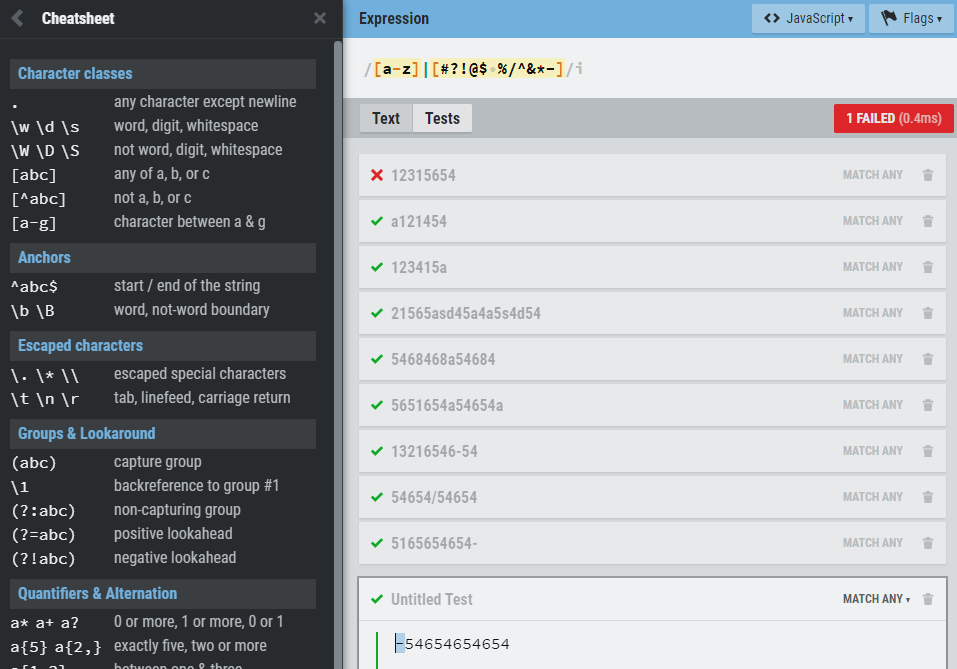

# Teste da Ewally de Backend

### Leitor de Códigos de Boleto e Guias de Arracadação 
--------------

## Como executar o programa:

1. Faça o download dos arquivos para uma pasta
2. Apesar da existência do pacote 'dotenv', o arquivo '.env' foi enviado para facilitar este passo a passo. No caso, nele está contido a porta 8080 a ser acessada.
3. Abra um command prompt (ou terminal no Linux) na raiz do projeto e digite o comando:
  ```
  npm install
  ```
4. Após o término da execução do comando anterior, digite em seguida:
  ```
  nodemon app.js
  ```
5. Utilizando um programa como Postman ou Insomnia, utilize o endereço abaixo para testar os diferentes códigos, sendo que o código do boleto a ser digitado deve substituir o texto 'xxxxxx':
  ```
  http://localhost:8080/boleto/xxxxxx
  ```
  --------------

## Observações:

Para filtrar a cadeia de caracteres do código do boleto e impedir a entrada de letras e caracteres especiais, foi criado um filtro utilizando RegEx conforme imagem abaixo:



Detalhamento:
  * [a-z] -> busca por caracteres do alfabeto, de '**a**' a '**z**'
  * [#?!@$%^&*-] -> este trecho que foi utilizado no programa, busca pelos '**caracteres especiais**' mais comuns
  * | -> 'barra vertical', equivalente a 'OU', indica que deve procurar a string que contenha 'caracteres do alfabeto **OU** caracteres especiais'
  * flag 'i' -> indica que a busca é '**case insensitive**', ou seja, ele leva em conta tanto letras maiúsculoas e minúsculas quando busca pelos caracteres do afabeto
 

  Após a verificação, o código recebido é rejeitado se houver um _match_.